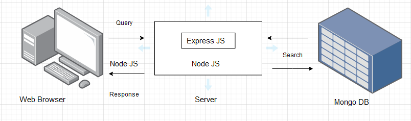

# Share with Buddy


## Problem statement

#### To create a platform where the people can interact and share their updates,daily routine or can exhibit their talent through posts and strories

<br>

## Features
- Login/Signup
    - Users should be able to signup with their basic details
        - name, mobile number, email, password, DOB, gender, profile picture
    - After signing up, users must be able to login
- After logging in users must be taken to the home page ( posts page )
- Posts page:
    - Users can see their posts and their friends posts here
    - Users can add/edit/delete their own posts
        - Post can have images, description, name, hashtags
    - Users can comment/like their posts and other user's posts
- profile page:
    - User can view their own profile details here
    - Users should be able to edit their profile details
        - name, mobile number, DOB, gender, profile picture
- Friends page:
    - Users should be able to view their list of friends
    - Users should have the ability to see people who are not friends, and send them friend request
    - Users should be able accept friend requets from others and able to deny friend request

    

<br>


## Proposed solution
#### The application contains 3 parts

- Frontend
    - Includes langages like
        - HTML
        - CSS
        - JAVASCRIPT etc.. and frameworks like Reactjs
    - This is the part of our application where the user interacts directly.. We can simply termed it as 'Client side' or 'User Interface'..It includes everything that user see on the screen like styles, images, colors, fonts, buttons, menu bar etc..
    
- Backend 
    - Backend is the service-side of the application 
    - this is the part where the user cannot directly interact with..
    - It serves content for the front end
    - It process the data and make sure whether everything on the client-side of the application 
- Database 
    - It stores all the data necessary for the application


<br>

## Architectural diagram



<br>

## Technologies used
- NodeJs
    - NodeJs is a server-side JavaScript run-time environment built on V8 Engine. We can easily build fast and scalable applications.. It can excecute javascript code outside of the browser
    - It provides a rich library of various JavaScript modules and also contains NODE PACKAGE MANAGER(Npm) 80000+ code packages to build efficient applications..
    - Express is a NodeJs framework that enables us to make application simpler and easier  to code without having to write large code and creating loads of Nodeb modules..
    - Express supports many middlewares which makes the code shorter and easier to write 
- ReactJs
    - React is a JavaScript library that is used for building user interfaces and it has the ability to handle rapidly changing data and handles routing
    - Virtal DOM -copy of original DOM 
    - JSX: JSX Stands for JavaScript XML. It is an HTML/XML JavaScript Extension which is used in React
    - Components: ReactJS supports Components
- MongoDb
    - MongoDB, which is a NoSQL database management system and in it each record is a document comprising of key-value pairs that are similar to JSON (JavaScript Object Notation) objects. MongoDB is flexible and allows its users to create schema, databases, tables, etc.


<br>

## MongoDB Specifications

#### You will find the list of schemas below

<br>

### Users Schema

```
{
    email: string,
    name: string,
    password: string,
    mobile: string
    country: string
}
```
### login schema
```
{
    user_id:string,
    password:string
}
```
### Post Schema
``` 
{
    PostId: string,
    caption: string,
    post_image: jpeg,
    location: link(not required),
    updated_at: Datetime,
    comment:string,
    likes:int
}
```
### Profile Schema

```
{
    email: string,
    mobile: string,
    user_name:string,
    first_name: string,
    last_name: string,
    country: string,
    Dob:string,
    Bio: string

}
```
### friendsList schema

```
{
    friends u_id:string
}
```
### users_Follow
```
{
    followers_count:int,
    followers u_id:string,
    following_count:string,
    following u_id:string,
}
```
### blocklist schema

```
{
    user_id:string,
    p_Id:string

}
```

### drafts schema
```
{
    post_id:string,
    post_img:jpeg,
    caption:string
}
```
<br>

## NodeJs Specifications

#### You will find the list routes below

<br>

### User Routes

### POST /user/login

Request body - 
```
{
    email: string, ( Required )
    password: string, ( Required, Must be atleast 8 characters )
}
```
Response body ( 200 ) - 
```
{
    userDetails: {
        email: string,
        name: string,
        mobile: string,
    }
}
```

Response body ( 400 ) - 
```
{
    error: {
        password: string, // Example - password: "must be atleast 8 characters"
    }
}
```
### POST /user/signup

Request body - 
```
{
    email: string,
    name: string,
    password: string,
    mobile: string,
    country: string,
    Dob:string,
}
```
Response body ( 200 ) - 
```
{
    userDetails: {
        email: string,
        name: string,
        mobile: string,
        user_id:string,
        country: string,
        Dob:string,
}
    }
}
```

Response body ( 400 ) - 
```
{
    error: {
        password: string, // Example - password: "must be atleast 8 characters"
    }
}
```
### POST /posts

Request body-
```
{
    uid:objectid,
    photo:jpeg,
    caption: string,
    location:url(not required)
}
```
Response body(200)-
```
{
        photo: jpeg,
        caption: string,
        created_At:dateTime
}
```
Response body(400)-
```
{
    error: {
        type: format error, // post format should be in jpeg,png formats
    }
}
```
### GET /posts

Request body-
```
{
    post_id:string,
    caption: string
}
```
Response body(200)-
```
{
    userPosts: {
        user_id:string,
        photo: string,
        caption: string,
        comment:string,
        likes_count:int,

    }
}
```
Response body(400)-
```
{
    error: {
        type: string, // no posts there
    }
}
```

### DELETE /posts

Request body-
```
{
    user_id:string,
    post_id:string,
    caption: string
}
```
Response body(200)-
```
{
    deletepost: {
        user_id:string,
        post_id: string,
        caption: string,
        comment:string,
        likes_count:int
    }
}
```
Response body(400)-
```
{
    error: {
        type: string, // no post to delete
    }
}
```

### POST /comment

Request body-
```
{
    user_id:string,
    comment:string
}
```
Response body(200)-
```
{
    comment: {
        user_id:string,
        photo: string,
        caption: string,
        comment:string
    }
}
```
Response body(400)-
```
{
    error: {
        type: string,// enter correct type
    }
}
```
### DELETE /comment

Request body-
```
{
    uid:id,
    postid:id,
    comment:string,
}
```
Response body(200)-
```
{
    comment: {
        username:characaters,
        photo: string,
        description: string,
        comment:string,
        deleted:true,
    }
}
```
Response body(400)-
```
{
    error: {
        type: string, // no comments yet
    }
}
```
### PUT  /comment

Request body-
```
{
    user_id:id,
    post_id:id,
    comment:string,
}
```
Response body(200)-
```
{
    updatedcomment: {
        user_id:string,
        post_id: string,
        caption: string,
        comment:string(changed),
    }
}
```
Response body(400)-
```
{
    error: {
        type: string,// same as previous comment
    }
}
```

### user/logout
Request body-
```
{
    user_id:string
}
```
Response body(200)-
```
{
    user_id:logged out,
}
```
Response body(400)-
```
{
    error: {
        type: string, //Try again
    }
}
```

###  GET/profile
Request body-
```
{
    user_id:string,
    profile_id:string
}
```
Response body(200)-
```
{
    profile:jpeg,
    user_id:string
}
```
Response body(400)-
```
{
    error: {
        type: string, //Not found
    }
}
```

###  PUT/profile
Request body-
```
{
    user_id:string,
    profile_id:string,
    user_id:string,
    email:string,
    mobile:string,
    Dob:string,
    country:string

}
```
Response body(200)-
```
{   
    profile:jpeg,
    user_id:string,
    email:string,
    mobile:string,
    Dob:string,
    country:string
    
}
```
Response body(400)-
```
{
    error: {
        type: string, //Not found
    }
}
```

### POST /like

Request body-
```
{
    user_id:string
}
```
Response body(200)-
```
{
    user_id:string,
    like_count
}
```
Response body(400)-
```
{
    error: {
        // no post found with that ID
    }
}
```


<br>

### React specifications

- Login Page
    - Feature to enter email,password and login
- Home page
    - This page will contain all the posts
- Signup page
    - Page will be available for user to signup to our application with their basic details like email,mobile,Dob
- friendsList page
    - this page will contain others profiles that user can follow
- log out page
    - this page enables the user to log from the application
- Profile page
    - this page will contain the details of the user like username,emai,mobile etc..
